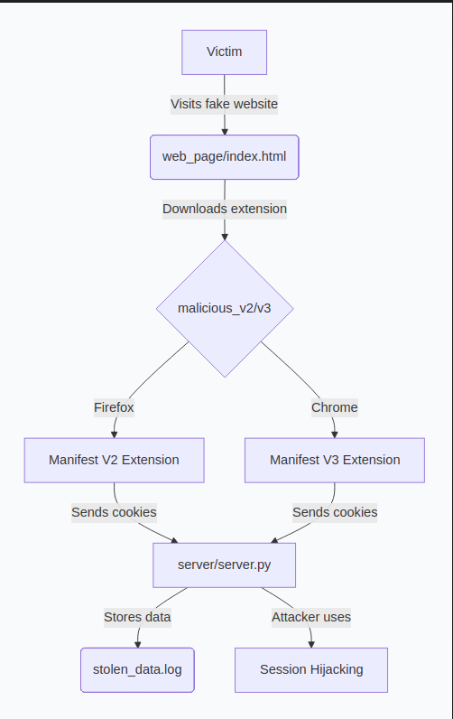

```markdown
# 🔐 Instagram Session Hijacking - Educational Proof of Concept

<div align="center">


**⚠️ EDUCATIONAL USE ONLY**


[](https://www.instagram.com/jonastrikex/)
[](https://www.tiktok.com/@jonastrikex)

</div>

### 🚨 CRITICAL WARNING - READ BEFORE PROCEEDING

<div align="center" style="border: 3px solid #ff4444; padding: 20px; border-radius: 10px; background-color: #fff0f0; margin: 20px 0;">

**⚠️ FOR EDUCATIONAL PURPOSES ONLY ⚠️**  
THIS IS A TECHNICAL DEMONSTRATION IN A CONTROLLED ENVIRONMENT  

**NEVER** use this knowledge to:  

- Access accounts that don't belong to you  
- Violate other people's privacy  
- Perform illegal activities  

**LEGAL CONSEQUENCES:**  

- Unauthorized computer access is a **CRIME** in most countries  
- Can result in severe fines and imprisonment  
- Permanent damage to your professional career  

**✅ PERMITTED USE:**  

- Learning in isolated labs  
- Authorized security research  
- Improving personal/organizational defenses  
- Ethical cybersecurity training  

</div>

### 📹 Complete Video Explanation

<div align="center">

[](https://www.youtube.com/watch?v=your_video_id_here)  

*Click the image to watch the complete demonstration on YouTube*

</div>

### 📖 Project Description

This repository contains an educational Proof of Concept (PoC) demonstrating Session Hijacking techniques through cookie theft. The objectives are:

1. Demonstrate how an attacker could potentially access accounts without credentials  
2. Educate about the risks of unverified browser extensions  
3. Provide practical defense tools and knowledge  

### ⚡ Technologies Used

- Python 3.8+ with Flask for the collector server  
- JavaScript for malicious browser extensions (DEMO)  
- HTML/CSS for the fake landing page  
- Multi-browser support (Firefox and Chrome)  

### 🗂️ Repository Structure

```
instagram-session-hijacking-poc/
│
├── malicious_v2/              # Firefox-based extension (Manifest V2)
│   ├── manifest.json
│   ├── background.js
│   ├── content.js
│   └── icons/
│       ├── icon-48.png
│       └── icon-96.png
│
├── malicious_v3/              # Chrome-based extension (Manifest V3)
│   ├── manifest.json
│   ├── background.js
│   ├── content.js
│   ├── popup.html
│   └── icons/
│       ├── icon-48.png
│       └── icon-96.png
│
├── server/                    # Attacker's collector server
│   ├── server.py
│   ├── requirements.txt
│   └── stolen_data.log
│
└── web_page/                  # Fake landing page for the attack
    ├── index.html
    ├── Privacy_Shield_ProV5.2.1.xpi
    └── Privacy_Shield_ProV5.2.1.zip
```

### 🔬 How the Attack Works (Technical Overview)

#### Attack Architecture

<div align="center">

  
*Ejemplo visual de flujo de session hijacking mediante cookie theft (fuente: AppCheck Security)*

<!-- Si subes tu cookie.png al repo, reemplaza la línea de arriba por: -->
<!--  -->

</div>

**Key Components:**

1. **Malicious Extensions** (`malicious_v2/`, `malicious_v3/`)
   - v2: Firefox-compatible (Manifest V2)
   - v3: Chrome-compatible (Manifest V3)
   - Both steal cookies from multiple websites
   - Send stolen data to the attacker's server
   - Use professional-looking icons and descriptions

2. **Collector Server** (`server/`)
   - Simple Flask application
   - Receives POST requests with stolen cookies
   - Logs all received data
   - Can be customized for specific targets

3. **Fake Landing Page** (`web_page/`)
   - Professional "Privacy Shield Pro" website
   - Convincing copy and fake testimonials
   - Download links for malicious extensions
   - Social engineering elements to build trust

### 🎯 Browser Compatibility

| Extension Version | Target Browser | Manifest Version | Key Features                                      |
|-------------------|----------------|------------------|---------------------------------------------------|
| malicious_v2      | Firefox        | V2               | Background pages · Broad permissions · Direct cookie access |
| malicious_v3      | Chrome/Edge    | V3               | Service workers · Limited permissions · Modern architecture |

### 🛡️ Defense Strategies

**For Regular Users:**

1. Only install from official stores (Chrome Web Store, Firefox Add-ons)
2. Review extension permissions before installation
3. Regularly audit installed extensions
4. Use browser security features (site isolation, enhanced protection)

**For Technical Users:**

1. Browser compartmentalization (different browsers for different activities)
2. Cookie monitoring extensions
3. Regular security audits
4. Use of specialized security tools

**For Organizations:**

1. Extension allowlisting
2. Network monitoring for unusual outbound connections
3. Employee security training
4. Implementation of security policies

### 📊 Attack Impact Analysis

| Website                | Stolen Data Type       | Potential Damage                               |
|------------------------|------------------------|------------------------------------------------|
| Instagram              | sessionid, csrftoken   | Account takeover, DM access                    |
| Facebook               | c_user, xs             | Profile access, friend list                    |
| Gmail                  | SID, HSID              | Email access, password reset                   |
| Banking sites          | session cookies        | Financial fraud, transactions                  |
| Any authenticated site | authentication tokens  | Full account compromise                        |

### ⚖️ Ethical Guidelines

**Do:**

- Test only on systems you own
- Use isolated virtual environments
- Document findings for educational purposes
- Report vulnerabilities responsibly
- Follow responsible disclosure practices

**Don't:**

- Target systems you don't own
- Use this knowledge maliciously
- Share stolen credentials
- Bypass security measures without authorization
- Violate terms of service

### 🔧 Getting Started (For Educational Purposes)

> **Note:** Detailed setup instructions are available in the accompanying video tutorial. This is a high-level overview.

**Basic Requirements:**

- Two separate machines/virtual machines (attacker and victim)
- Python 3.8+ on attacker machine
- Modern web browsers (Firefox and/or Chrome)
- Network connectivity between machines

**High-Level Process:**

1. Setup attacker server: Run `server/server.py` on attacker machine
2. Configure extensions: Update server address in extension files
3. Host fake website: Serve `web_page/` content
4. Simulate attack: Follow video demonstration steps

### 🌐 Connect with the Creator

<div align="center">

[](https://jonas-fernandez-as.github.io)
[](https://www.instagram.com/jonastrikex/)
[](https://www.tiktok.com/@jonastrikex)
[](https://www.linkedin.com/in/jon%C3%A1s-fern%C3%A1ndez-as)
[](https://www.youtube.com/@tu_canal_aqui) <!-- Reemplaza con tu URL real -->

</div>

### 📚 Additional Resources

**Learning Ethical Hacking:**

- OWASP Web Security Testing Guide
- PortSwigger Web Security Academy
- MITRE ATT&CK Framework

**Browser Security Tools:**

- uBlock Origin - Advanced content blocker
- NoScript Security Suite - JavaScript control
- Cookie AutoDelete - Cookie management

**Security Best Practices:**

- Always use 2FA/MFA where available
- Regularly review account security settings
- Use password managers with unique passwords
- Keep software and browsers updated

### 📄 License

This project is licensed under the MIT License with Ethical Restriction:

```
MIT License

Copyright (c) 2024 Jonás Fernández

Permission is hereby granted, free of charge, to any person obtaining a copy
of this software and associated documentation files (the "Software"), to deal
in the Software WITHOUT MALICIOUS INTENT, exclusively for:
- Authorized security research
- Cybersecurity education
- Testing in controlled, owned environments

EXPRESSLY PROHIBITED use of this Software for:
- Unauthorized access to systems
- Privacy violation of third parties
- Any illegal activity under applicable laws

THE AUTHOR IS NOT RESPONSIBLE for misuse of this Software.
```

<div align="center">

**Found this useful?**  
⭐ Star this repository to support educational content  
📢 Share responsibly - Educate, don't encourage harmful behavior  
🔔 Subscribe to my YouTube channel for more technical analysis  

*"Cybersecurity knowledge is a scalpel: in wrong hands it causes harm, in expert hands it saves digital lives."*

</div>
```
