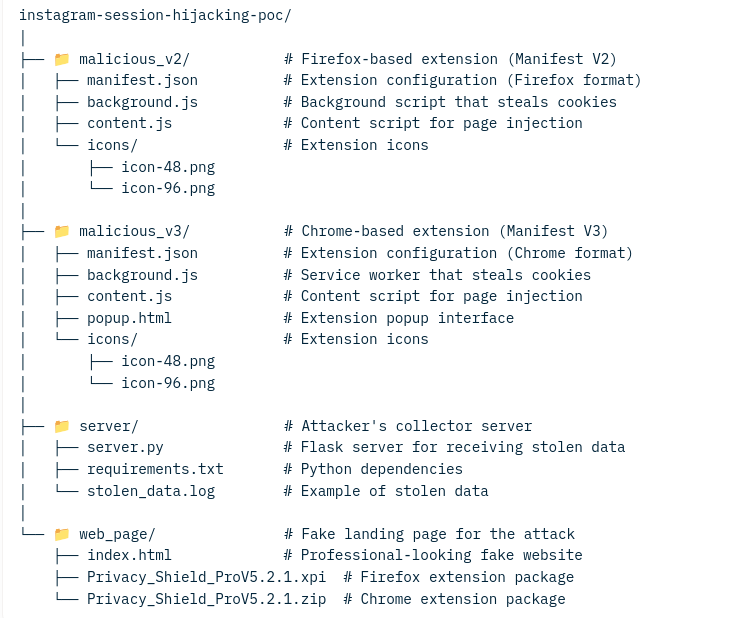

# 🔐 Instagram Session Hijacking - Educational Proof of Concept

**⚠️ EDUCATIONAL USE ONLY**

### 🚨 CRITICAL WARNING - READ BEFORE PROCEEDING

**⚠️ FOR EDUCATIONAL PURPOSES ONLY ⚠️**  
THIS IS A TECHNICAL DEMONSTRATION IN A CONTROLLED ENVIRONMENT  

**NEVER** use this knowledge to:  

- Access accounts that don't belong to you  
- Violate other people's privacy  
- Perform illegal activities  

**LEGAL CONSEQUENCES:**  

- Unauthorized computer access is a **CRIME** in most countries  
- Can result in severe fines and imprisonment  
- Permanent damage to your professional career  

**✅ PERMITTED USE:**  

- Learning in isolated labs  
- Authorized security research  
- Improving personal/organizational defenses  
- Ethical cybersecurity training  

### 📹 Complete Video Explanation

  

*Click the image to watch the complete demonstration on YouTube (reemplaza el link con tu video real)*

### 📖 Project Description

This repository contains an educational Proof of Concept (PoC) demonstrating Session Hijacking techniques through cookie theft. The objectives are:

1. Demonstrate how an attacker could potentially access accounts without credentials  
2. Educate about the risks of unverified browser extensions  
3. Provide practical defense tools and knowledge  

### ⚡ Technologies Used

- Python 3.8+ with Flask for the collector server  
- JavaScript for malicious browser extensions (DEMO)  
- HTML/CSS for the fake landing page  
- Multi-browser support (Firefox and Chrome)  

### 🗂️ Repository Structure

### 🔬 How the Attack Works (Technical Overview)

#### Attack Architecture

**Key Components:**

1. **Malicious Extensions** (`malicious_v2/`, `malicious_v3/`)
   - v2: Firefox-compatible (Manifest V2)
   - v3: Chrome-compatible (Manifest V3)
   - Both steal cookies from multiple websites
   - Send stolen data to the attacker's server

2. **Collector Server** (`server/`)
   - Simple Flask application
   - Receives POST requests with stolen cookies
   - Logs all received data

3. **Fake Landing Page** (`web_page/`)
   - Professional-looking fake website to trick users into installing the extension

### 🌐 Connect with the Creator

**Found this useful?**  
⭐ Star this repo · 📢 Share responsibly · 🔔 Subscribe for more cybersecurity content  

*"Cybersecurity knowledge is a scalpel: in wrong hands it causes harm, in expert hands it saves digital lives."*

